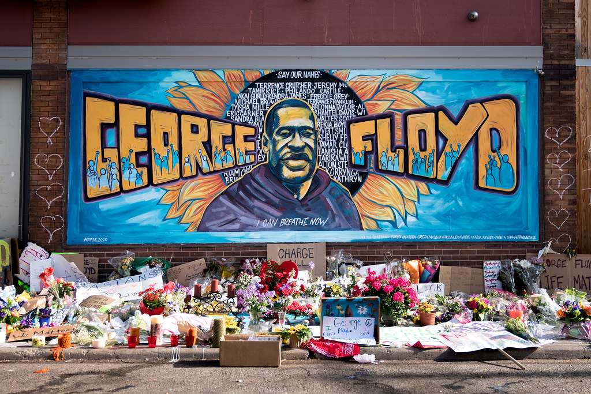

# George Floyd
#BlackLivesMatter #SpeakUp

George Floyd, 46, was a bouncer at a restaurant at the time of his death. His family said he played sports for years and was a “gentle giant. He was murdered as a part of police brutality which systemtically claims more black lives than white. It is a strong example of how racism exists throughout the World, and we need to come together, mobilise, and speak up for justice. We owe it to George, we owe it to everyone.

Different Repositories

# SARAL - the eLearning platform
https://saral.navgurukul.org
Backend : https://github.com/navgurukul/galileo #TypeScript #HapiJs #NodeJS
Frontend : https://github.com/navgurukul/kamaladevi #React
